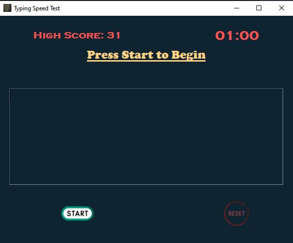
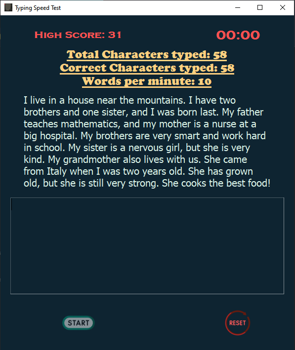

# TypingTest
GUI application - Test you typing speed based on the random text 

### Written in python 3.10 

## Installation on Windows:
* `git clone https://github.com/snehangsude/TypingTest.git`
* `cd TypingTest`
* `python main.py`

## Installation on Linux and Unix like OS:
* `git clone https://github.com/snehangsude/TypingTest.git`
* `cd TypingTest`
* `python3 main.py`

## Interface images

* Starting Interface:

* Ending Interface:

## How to Run

* Run the application using the Installation section
* Click on the `Start` button
* The timer is set to 61 secs with a 1 second buffer to read the text that pops up
* Once the timer hits 0:00 the amount of words written would be automatically counted and the report would be published
* Any thing written post 0:00 would be ignored and not counted
* Your High Score would be saved and would help you track your progress as you practice
* To reset and restart click on the `Reset` button and it would clear the window and start afresh
